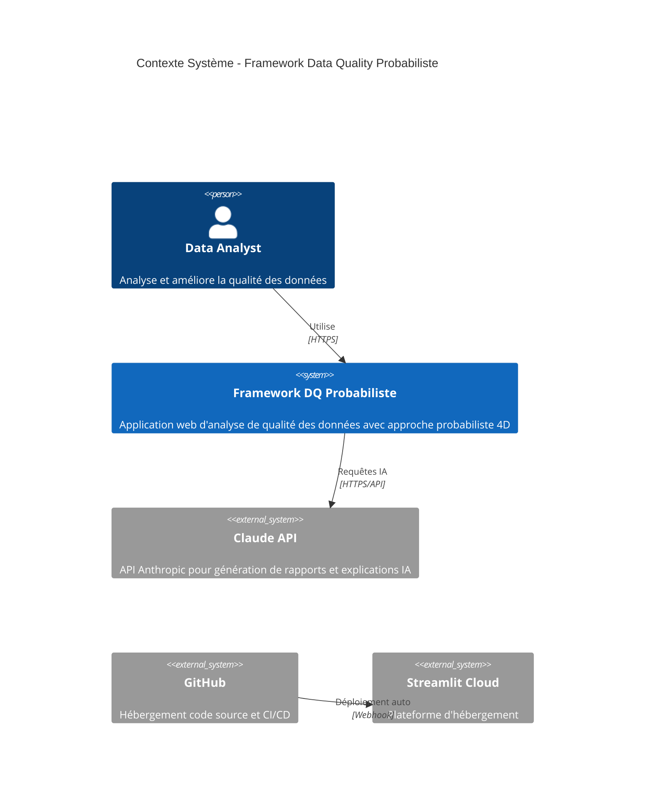
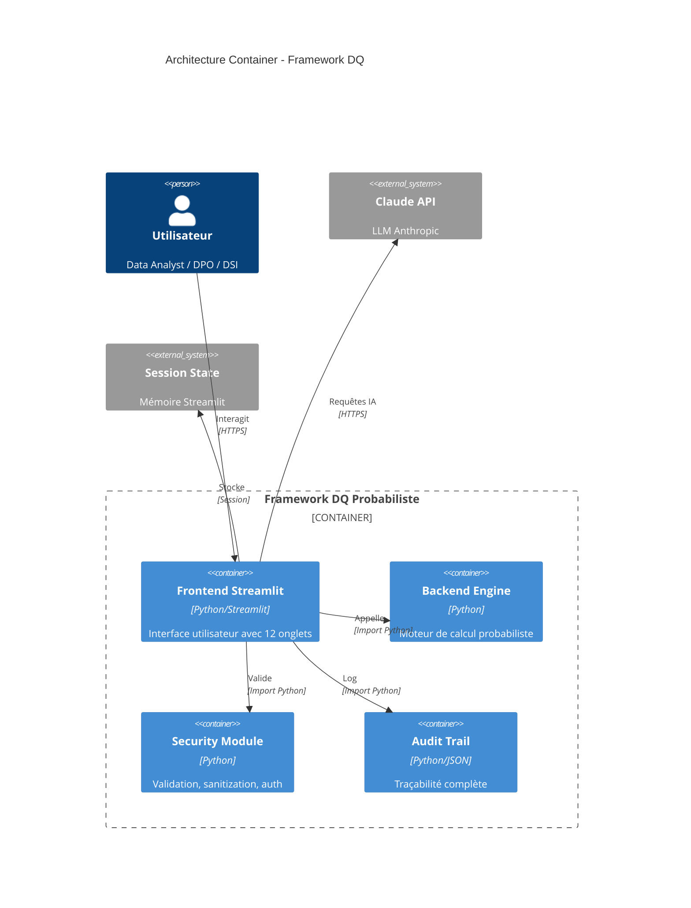
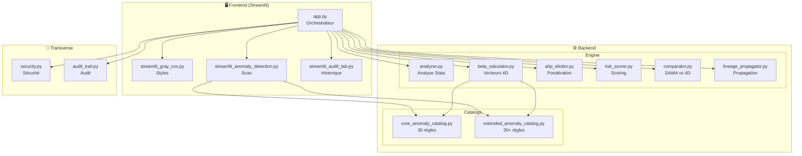
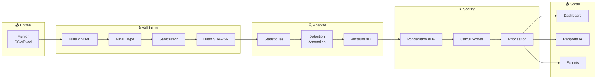
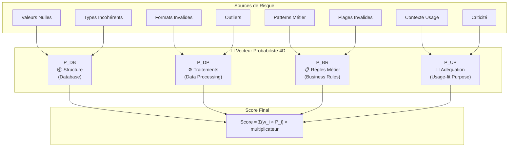
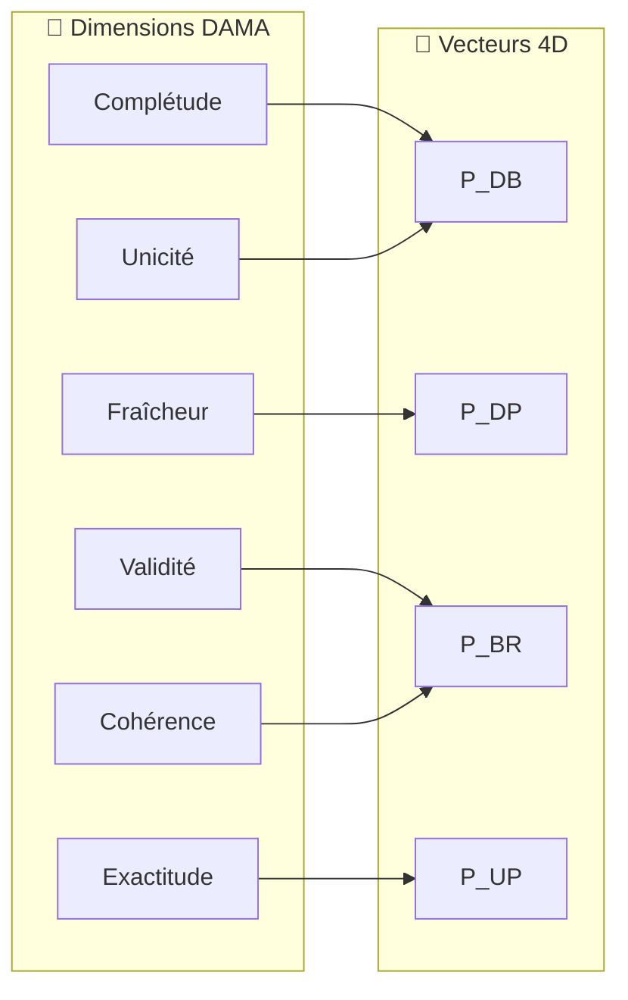
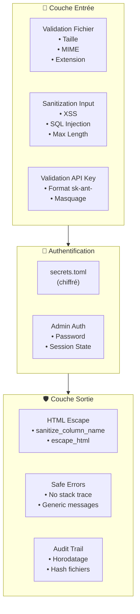
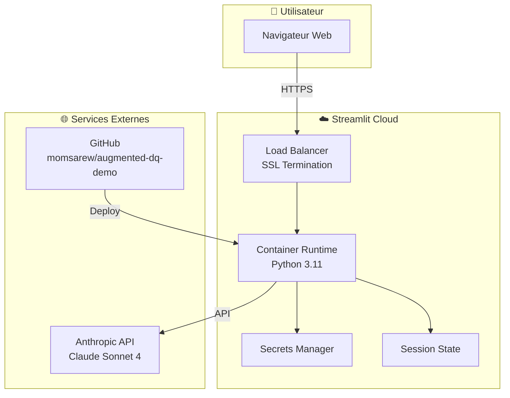
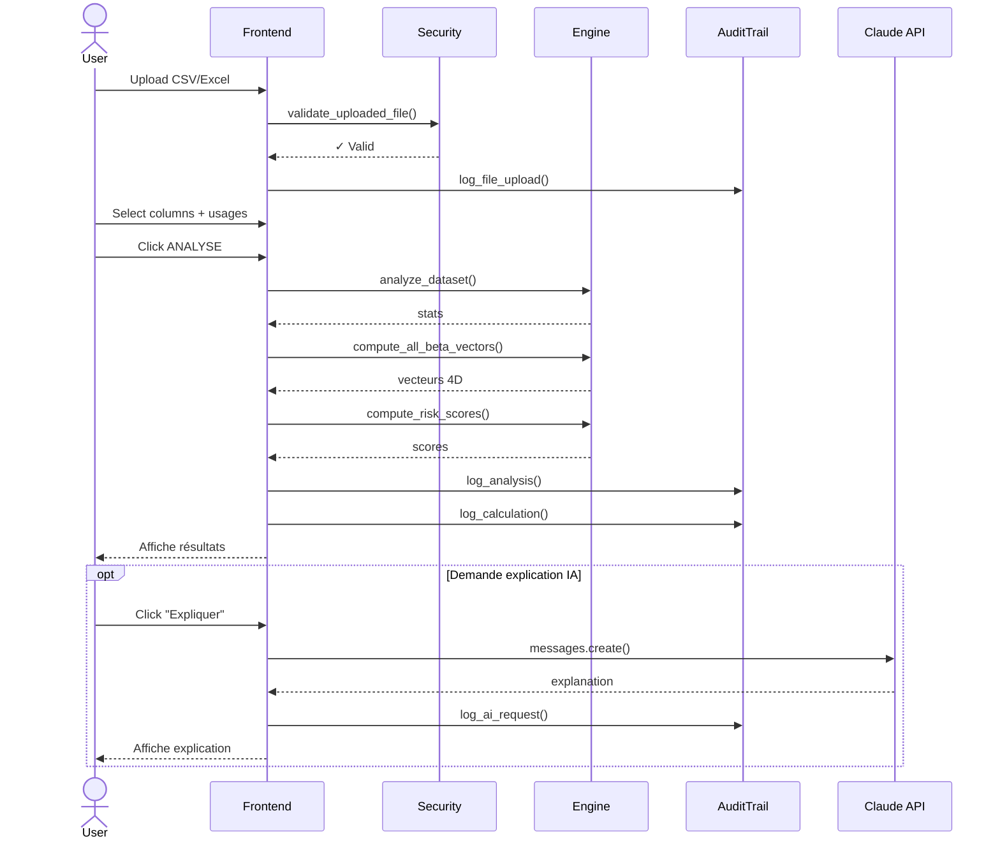
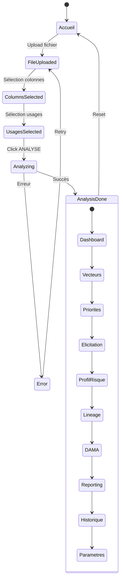

# Diagrammes d'Architecture - Framework DQ Probabiliste

> Ces diagrammes utilisent la syntaxe Mermaid, supportée nativement par GitHub.

## 1. Vue Contexte (C4 - Level 1)

## 2. Architecture Container (C4 - Level 2)

## 3. Architecture Composants (C4 - Level 3)

## 4. Flux de Données Principal

## 5. Modèle Probabiliste 4D

## 6. Mapping DAMA ↔ 4D

## 7. Architecture de Sécurité

## 8. Architecture de Déploiement

## 9. Diagramme de Séquence - Analyse

## 10. États de l'Application

---

## Légende

| Symbole | Signification |
|---------|---------------|
| 📥 | Entrée de données |
| 📤 | Sortie de données |
| 🔐 | Sécurité |
| 🎯 | Scoring/Ciblage |
| ⚙️ | Traitement |
| 📊 | Analyse/Dashboard |
| 🤖 | Intelligence Artificielle |

---

*Généré le 2025-02-06 - Version 1.2.0*
